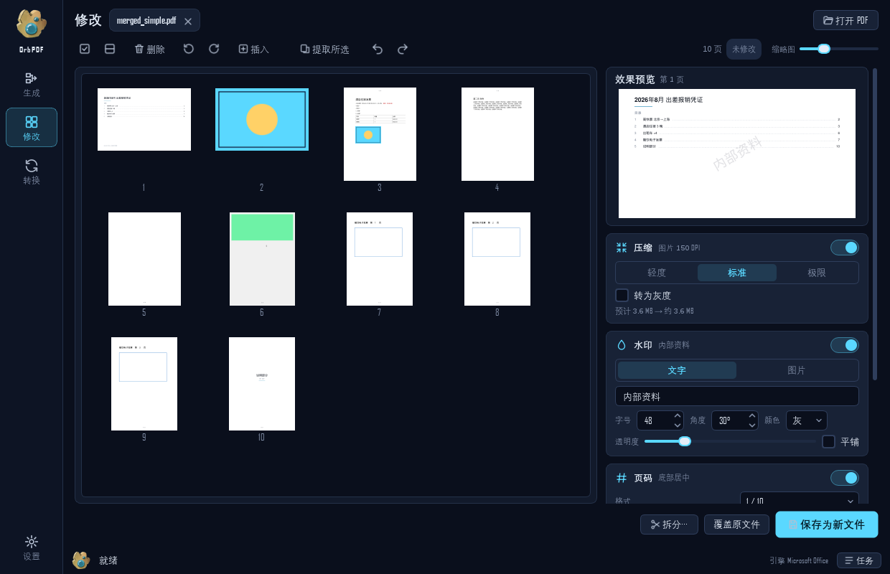

<p align="center">
  
</p>

<h1 align="center">OrbPDF</h1>

<p align="center">一个 exe 的全能 PDF 工作台 · 生成 · 修改 · 转换<br>
<sub>A single-file, portable PDF workbench for Windows: make / edit / convert.</sub></p>

<p align="center">
  <a href="../../releases/latest"><b>⬇ 下载最新版 OrbPDF.exe</b></a> ·
  <a href="#快速上手">快速上手</a> ·
  <a href="#隐私">隐私</a> ·
  <a href="#从源码运行与打包">从源码运行</a>
</p>

---

把 PDF、Word、PPT、Excel、图片按你想要的顺序串成**一个带目录的 PDF**，是 OrbPDF 的核心。围绕 PDF 它只做三件事：

| | 做什么 |
|---|---|
| **生成** | 无限画布上把文件变成节点，连线顺序就是文档顺序。起点是「目录页」，终点是「导出」。拖节点自由摆放，拖线重排，节点丢到线上就是插入。「合成一个」输出带目录、书签的单个 PDF；「各自一个」每个文件单独出一个 PDF |
| **修改** | 打开一个或多个 PDF：缩略图上删页、旋转、拖拽换序、插入、提取；右侧打开压缩、水印、页码、加密四个步骤，选中页实时预览效果，保存时一次应用；同一套步骤可以应用到全部打开的文件；还能拆分 |
| **转换** | PDF → 图片 / 文本 / Word，提取 PDF 里嵌入的图片 |

<p align="center">
  
  
</p>

## 特点

- **单个 exe，随手就能用**：不用安装，不用 Python，不用 Office。放在任何磁盘的任何文件夹都能运行，也可以直接发给朋友。
- **有 Office 更好，没有也不报错**：Word / PPT / Excel 的转换按 Microsoft Office → WPS → LibreOffice → 内置引擎 的顺序尝试。装了 Office 的电脑效果等同 Office 自己导出；没装的电脑用内置引擎，内容完整、排版简化。
- **图片转 PDF 不留白边**：页面比例就是图片比例，JPEG 原图不二次压缩。
- **目录页可点击**：首页目录条目点一下就跳到对应文件，同时写入 PDF 书签。
- **所见即所得**：旋转、水印、页码都在缩略图或预览里直接看到最终效果。
- **一点小惊喜**：界面里的机器人和五颗充能球致敬《杀戮尖塔 2》的故障机器人。文件是球，画布是球槽，导出就是「激发」。

## 快速上手

1. 从 [Releases](../../releases/latest) 下载 `OrbPDF.exe`，放到任意位置，双击。
2. 第一次运行 Windows 可能弹出 SmartScreen 提示（程序没有数字签名）：点「更多信息 → 仍要运行」。
3. 首次启动约 3 到 4 秒（单文件自解压），之后打开就快了。
4. 把文件拖进「生成」的画布，改改标题，点「导出 PDF」。

支持的输入：PDF · docx / doc · pptx / ppt · xlsx / xls / csv · jpg / png / bmp / gif / tif / webp · txt / md / html。

## 隐私

- exe 里**只有程序和它自带的图片**，不含任何使用记录、文件名或路径（打包时源码路径也被替换成相对路径）。
- 设置和日志保存在 `%APPDATA%\OrbPDF`，临时缓存在 `%TEMP%\OrbPDF`（退出时自动清理）。这些都在你自己的电脑上，不会进入 exe，也不会被上传到任何地方。
- 程序不联网。exe 所在的文件夹永远不会被写入。

## 从源码运行与打包

```bash
git clone https://github.com/<你的用户名>/OrbPDF.git
cd OrbPDF
python -m venv .venv
.venv\Scripts\pip install -r requirements.txt
.venv\Scripts\python -m app
```

打包成单个 exe（生成 `dist\OrbPDF.exe`）：

```bash
.venv\Scripts\python build\build.py
```

验证：`dist\OrbPDF.exe --selftest` 会在无界面的情况下跑一遍转换和合并并打印 `SELFTEST OK`。

测试：

```bash
.venv\Scripts\python tests\test_convert.py     # 所有转换引擎
.venv\Scripts\python tests\test_merge.py       # 合并 / 目录 / 拆分 / 压缩 / 水印 / 加密
.venv\Scripts\python tests\test_ui_flow.py     # 离屏跑一遍三个工作台
```

## 目录结构

```
app/            源码（core 不依赖 Qt；ui 是 PySide6 界面）
app/assets/     机器人头像、五颗充能球、图标、启动画面
build/          PyInstaller spec 与打包脚本
docs/           设计文档、页面原型、截图、GitHub 上传教程
tests/          测试与样例生成脚本
tools/          素材处理脚本
```

## 常见问题

**朋友打开时报"Windows 已保护你的电脑"？** 这是未签名程序的标准提示，点「更多信息 → 仍要运行」。

**PDF 转 Word 很慢？** 默认用内置引擎（几秒），文字、表格、图片都在，排版简化。选「本机 Word」可以得到更接近原版的排版，但 Word 重排一个文件可能要几分钟。

**出了问题怎么办？** 设置 → 缓存与日志 → 导出诊断包，把 zip 发给作者。里面只有日志、设置和环境信息，不含文档内容。

## 许可

源码依 [AGPL-3.0](LICENSE) 发布（因为使用了 PyMuPDF）。其它组件：PySide6（LGPL）、Pillow、python-docx、python-pptx、openpyxl、pywin32、PyInstaller。

界面吉祥物为致敬《杀戮尖塔 2》（Mega Crit）的粉丝创作，仅用于非商业用途，相关形象版权归原作者所有。
